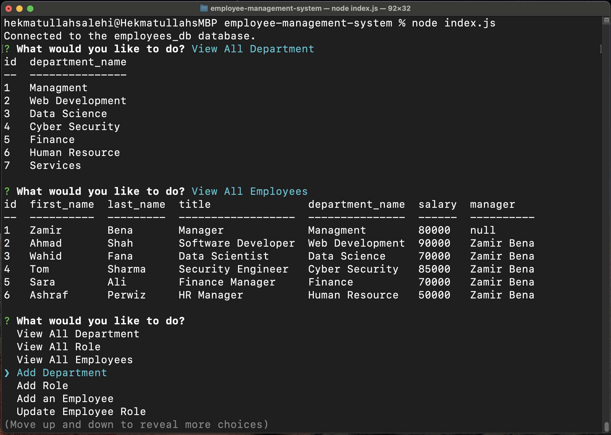

# Employee Management System
## Description
This is a command line application.


## Table of Contents
* [Installation](#Installation)
* [Usage](#Usage)
* [License](#License)
* [Questions](#Questions)
## Installation
Clone the employee-management-system repository to your local computer. Run ```npm install``` in the command line (Win) or terminal (Mac) to install dependencies. Also MySQL server is required for this application.
## Usage
Open Command line (Win) or Terminal (Mac). Go to the employee-management-system folder then run ```node index.js```


 
[Walkthrough Video](https://drive.google.com/file/d/1VZ7RjLtHWsa5zSOrYMJNyF4IUTEmF9hx/view?usp=sharing)

## License
This Application is covered under MITLicense

For more information about the License visit [MIT License Page](https://choosealicense.com/licenses/mit/)
## Questions
For further questions please contact me at:

GitHub: [https://github.com/hekmatsalehi](https://github.com/hekmatsalehi)

Email: [hekmatullahsalehi@gmail.com](mailto:hekmatullahsalehi@gmail.com)